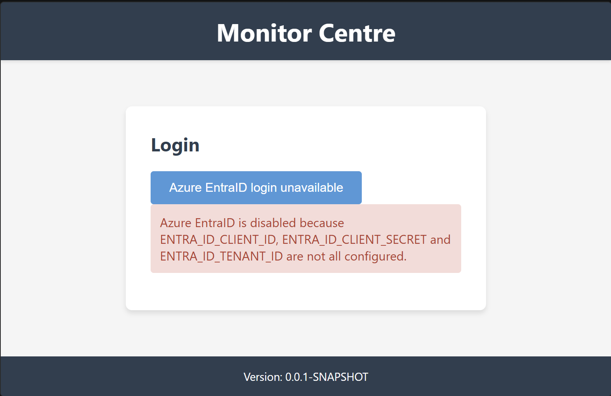
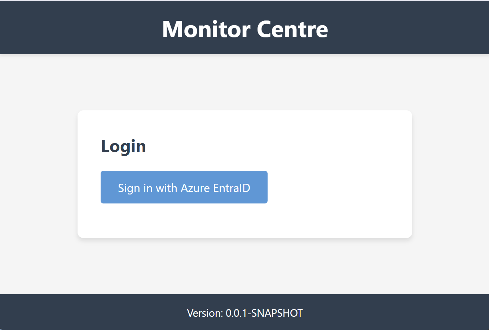

# Monitor Centre Application

A Spring MVC web application for monitoring and management, built with Java 17 and deployed as a WAR file. For CI/CD see [Environments](https://v8lust.atlassian.net/wiki/spaces/HDC/pages/933685/SMVC+Monitor+Centre#Environments) in Confluence.

## Prerequisites

Before running this application locally, ensure you have the following installed:

- **Java 17** or higher
- **Apache Maven 3.6+**
- **Apache Tomcat 10** or any Jakarta EE 9+ compatible web container

## Project Structure

```
src/
├── main/
│   ├── java/
│   │   └── hdc/company/monitor/
│   │       ├── config/          # Spring configuration classes
│   │       └── controller/      # MVC controllers
│   ├── resources/
│   │   └── version.properties   # Application version
│   └── webapp/
│       └── WEB-INF/
│           └── templates/       # Thymeleaf templates
└── test/
    ├── java/                    # Unit tests
    └── resources/               # Test configuration
```

## Building the Application

### 1. Clean and Package
```bash
mvn clean package
```

This will:
- Compile the Java source code
- Run unit tests
- Generate a WAR file in the `target/` directory named `monitor-centre.war`

### 2. Skip Tests (if needed)
```bash
mvn clean package -DskipTests
```

### 3. Generate Coverage Output in Cobertura XML Format
Run the normal package build with tests enabled:
```bash
mvn clean package -DskipTests=false
```

This will produce:
- `target/site/cobertura/coverage.xml` (Cobertura XML format)
- `target/site/cobertura/index.html` (human-readable HTML report)
- `target/site/jacoco/jacoco.xml` (intermediate JaCoCo XML)
- `target/junit-reports` (JUnit XML output)

If you want to run only tests and still generate coverage reports, use:
```bash
mvn test
```

The Cobertura XML report is generated automatically during the package phase by converting the JaCoCo report into Cobertura format.

## Running Locally

### Using Cargo Maven Plugin (Recommended for Development)

The `cargo-maven3-plugin` is configured in `pom.xml`, so you can run:

```bash
mvn clean package cargo:run -DskipTests
```

The application will be available at: `http://localhost:8080/smvc`

> See eclipse-setup.md for alternative options.

## Development Workflow

### Azure EntraID environment variables
The application reads Azure EntraID configuration from `src/main/resources/entra-id.properties`, which resolves these environment variables:

- `ENTRA_ID_CLIENT_ID` – your Azure application client ID
- `ENTRA_ID_CLIENT_SECRET` – your Azure application client secret
- `ENTRA_ID_TENANT_ID` – your Azure tenant ID
- `ENTRA_ID_REDIRECT_URI` – optional redirect URI (default: `http://localhost:8080/smvc/login/oauth2/code/entra`)
- `STATUS_API_URL` – base URL for the backend status API. e.g. `http://localhost:8000/` The application automatically appends `status.php` to this value for dashboard status requests.
- `PHP_API_SCOPE` - the scope required for the backend PHP API (default: `api://bf53ad5f-760d-40e8-a6db-467eacada791/access_as_user`). Used in the On-Behalf-Of flow.

Set all required values and run the app to enable the EntraID/OAuth2 login flow and backend status lookup. If `STATUS_API_URL` is not set, the status dashboard will not call the backend API.

### Microsoft EntraID On-Behalf-Of (OBO) Flow
The application implements the Microsoft EntraID On-Behalf-Of (OBO) flow. When a user logs in, the application receives an initial access token. This token is then exchanged for a new access token specifically for the PHP API using the `PHP_API_SCOPE`. This API-specific token is passed as the Bearer token in the `Authorization` header when calling the backend status API.

#### Troubleshooting OBO Errors

1. **AADSTS65001: The user or administrator has not consented to use the application**
   - This occurs if the application does not have permission to request a token for the target API on behalf of the user.
   - **Fix:** Go to the Azure Portal -> Microsoft Entra ID -> App Registrations. Find the 'Monitor Centre' registration. Go to **API Permissions**, click **Add a permission**, select **APIs my organization uses**, search for your PHP API, and add the `access_as_user` scope. Finally, click **Grant admin consent for [Your Org]**.

2. **AADSTS70011: .default scope can't be combined with resource-specific scopes**
   - This occurs if you attempt to request both the Graph API default scope and the PHP API specific scope in the initial login request.
   - **Fix:** The application is configured to only request standard OIDC scopes and the Graph `.default` scope during login. The PHP API scope is only used during the server-side OBO exchange. Do not add the PHP API scope to the initial login scopes in `SecurityConfig`. Ensure it is only configured via the `PHP_API_SCOPE` environment variable.



For Cargo-based local launch, make sure the environment variables are defined in the same PowerShell session that starts Maven:

```powershell
$env:ENTRA_ID_CLIENT_ID = "<your-client-id>"
$env:ENTRA_ID_CLIENT_SECRET = "<your-client-secret>"
$env:ENTRA_ID_TENANT_ID = "<your-tenant-id>"
mvn cargo:run
```

Once set, the Sign in button will be presented



Run tests
---------

To run unit tests:

```powershell
mvn clean test
```

You can also run a single test:

```powershell
mvn -D"test=SecurityConfigTest" test
```

JUnit XML Test Reports
----------------------

The Maven Surefire plugin is configured to emit JUnit-compatible XML reports into the `target/junit-reports` directory.

To generate the XML reports locally (using the `dev` profile):

```powershell
$env:SPRING_PROFILES_ACTIVE = "dev"
mvn -DskipTests=false test
```

After the run, look for files matching `target/junit-reports/TEST-*.xml`. These can be consumed by CI systems (e.g., Jenkins, GitHub Actions) to display test results and trends.


### Running Tests
```bash
# Run all tests
mvn test

# Run specific test class
mvn test -Dtest=HomeControllerTest

# Run tests with detailed output
mvn test -X
```

### Code Compilation Only
```bash
mvn compile
```

### Clean Build Directory
```bash
mvn clean
```

## Application Features

- **Login Interface**: Clean, responsive login form (placeholder functionality)
- **Version Display**: Shows application version from `version.properties`
- **Responsive Design**: Mobile-friendly interface
- **Spring MVC**: RESTful controller architecture
- **Thymeleaf Templates**: Server-side rendering

## Configuration

### Application Properties
- Version information is managed in `src/main/resources/version.properties`
- Maven filtering is enabled to inject build-time properties

### Spring Configuration
- Java-based configuration in `hdc.company.monitor.config` package
- No XML configuration files required (except for tests)

## Troubleshooting

### Common Issues

1. **Port 8080 already in use**
   ```bash
   # Find process using port 8080
   lsof -i :8080
   # Kill the process or use a different port
   ```

2. **Java version mismatch**
   ```bash
   # Check Java version
   java -version
   javac -version
   ```

3. **Maven compilation errors**
   ```bash
   # Clean and reinstall dependencies
   mvn clean install -U
   ```

### Logs Location
- Tomcat logs: `$TOMCAT_HOME/logs/catalina.out`
- Application logs: Check Tomcat's `localhost.log`

## Contributing

1. Follow Java coding standards
2. Write unit tests for new functionality
3. Update documentation as needed
4. Test locally before committing

## Technology Stack

- **Java 17**
- **Spring MVC 6.0.13**
- **Thymeleaf 3.1.2**
- **Maven 3.x**
- **JUnit 5** (for testing)
- **Jakarta Servlet API 6.0**